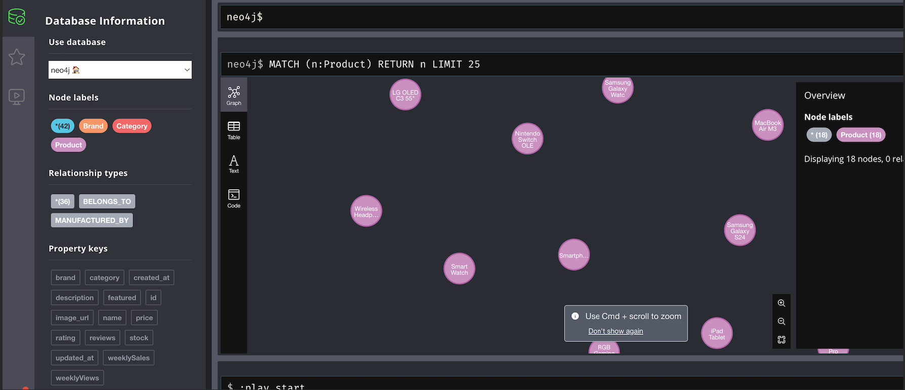
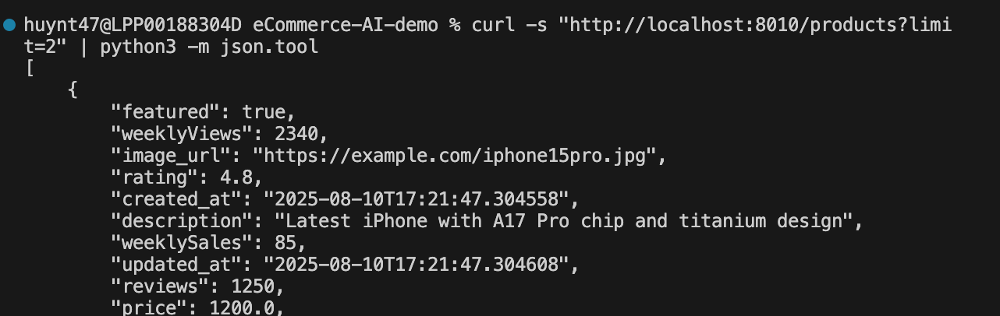

# eCommerce Backend v2 (Neo4j Edition)

This is the backend v2 using Neo4j graph database instead of Firebase.

## Prerequisites

- Python 3.9+
- Neo4j database instance
- pip (Python package installer)

## Setup Instructions

### 1. Set up Neo4j Database

Run a new Neo4j instance, either locally with Docker or use a remote instance:

**Option A: Docker (Local)**
```bash
docker run \
    --name neo4j \
    -p7474:7474 -p7687:7687 \
    -d \
    --env NEO4J_AUTH=neo4j/your_password \
    neo4j:latest
```

**Option B: Remote Instance**
Get the instance URL and credentials from your Neo4j provider.

### 2. Configure Environment Variables

Copy the environment template:
```bash
cp .env.example .env
```

Update the credentials in `.env` file:
```env
NEO4J_URI=neo4j://localhost:7687  # or your remote URI
NEO4J_USERNAME=neo4j
NEO4J_PASSWORD=your_password
PORT=8010
```

### 3. Install Dependencies

```bash
pip install -r requirements.txt
```

### 4. Run Data Migration

Run the migration script to add sample data to your Neo4j instance:
```bash
python3 migrate_data.py
```

This will create:
- 18 products
- 15 brands  
- 9 categories
- Proper graph relationships

### 5. Start the Server

```bash
python3 start_simple.py
```

The server will be available at: http://localhost:8010

## API Documentation

Once the server is running, visit:
- **API Docs**: http://localhost:8010/docs (Swagger UI)
- **Health Check**: http://localhost:8010/health

## Sample Screenshots

### Neo4j Database UI


### API Testing


## Key Features

- ✅ Neo4j graph database integration
- ✅ FastAPI backend with auto-reload
- ✅ Environment-based configuration
- ✅ Comprehensive product management API
- ✅ Brand and category relationships
- ✅ CORS enabled for frontend integration

## Troubleshooting

### Common Issues

1. **Connection refused**: Make sure Neo4j is running and accessible
2. **Authentication failed**: Check your credentials in `.env`
3. **Port already in use**: Change the PORT in `.env` or kill existing processes

### Testing the Setup

```bash
# Test database connection
curl http://localhost:8010/health

# Get products
curl http://localhost:8010/products?limit=5

# Get specific product
curl http://localhost:8010/products/1
```
